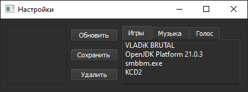

# Volume Group Controller

Программа для управления громкостью приложений через группы с использованием SoundVolumeView



## Функционал

- 🎚️ Групповое управление громкостью приложений
- 🖱️ Перетаскивание приложений между группами
- 💾 Автосохранение настроек между запусками
- ⌨️ Горячие клавиши для быстрого управления
- 📂 Интеграция с SoundVolumeView

## Установка

1. Скачайте [SoundVolumeView](https://www.nirsoft.net/utils/sound_volume_view.html)
2. Поместите `SoundVolumeView.exe` в папку с программой
3. Установите зависимости:
```bash
pip install -r requirements.txt
